# PENETRATION TESTING REPORT
## FOOTPRINTING & NETWORK SCANNING PHASES
### `CYBERSECURITY | NETWORKWALKS`

---

| Field | Details |
| :--- | :--- |
| **Pentester** | Cybersecurity Professional |
| **Program / Batch** | B082-Networkwalks |
| **Date** | 21 August 2026 |
| **Modules Completed** | • **W2-PM1** (Multiple Kali Reconnaissance Tools) • **W2-PM2** (Google Hacking Database - GHDB) • **W2-PM3** (Maltego Visual OSINT) • **W2-PM4** (theHarvester Passive Asset Discovery) • **W2-PM5** (Zenmap & Nmap Subnet Scanning) |
| **Client / Target** | 1. **Networkwalks** (`networkwalks.com` — secured written permission already) 2. **My own local LAN Network** (`192.168.64.0/24`) |
| **Permission secured from client?** | Yes |
| **Phases Covered** | • Phase 1: Reconnaissance & Footprinting • Phase 2: Scanning & Network Discovery • Phase 3–5: In Progress |

---

## 1. Liability Disclaimer

I have performed these activities only on the systems & devices where I had secured written permission or the devices/systems that I own myself. All these materials are for education and research purpose only. Do not use anything from here to break the law. The instructor, the authors and Networkwalks are not responsible for what you do with this knowledge. Every action you take is your own responsibility. Misuse can lead to criminal charges, heavy fines, loss of your job and a permanent record. In most countries unauthorised access is a crime even when nothing is damaged.

---

## 2. Introduction

This report covers footprinting the `networkwalks.com` domain using multiple Kali Linux tools (W2-PM1), performing Google Dorking (W2-PM2), visual OSINT mapping with Maltego (W2-PM3), passive harvesting with theHarvester (W2-PM4), and scanning my own local network with Zenmap (W2-PM5).

Together, these modules show how an attacker moves from gathering public information to mapping live hosts on a network. It is the Week 2 part of my ongoing cybersecurity internship program at Networkwalks.

All commands were run in Kali Linux (footprinting) and on a Windows PC with Zenmap installed (scanning). Every step below includes the tool used, a concise summary of the observation, a screenshot as evidence, and a note on why the finding matters. *(Note: Personally identifiable hardware MAC addresses, local user directory paths, and third-party live camera IP endpoints have been redacted for responsible security disclosure).*

---

## 3. Tools Used

The table below lists each tool used in this report and its purpose:

| Tool | Purpose |
| :--- | :--- |
| **Kali Linux & Windows** | Operating systems used for reconnaissance and scanning activities. |
| **WHOIS** | Find domain registration details (owner, dates, name servers). |
| **whatweb** | Fingerprint web technologies (server, CMS, plugins, IP). |
| **nslookup** | Resolve the domain name to its IP address using DNS. |
| **curl -I** | Read HTTP response headers and web server information. |
| **wafw00f** | Detect whether a Web Application Firewall protects the site. |
| **dnsrecon** | Enumerate all DNS records (NS, MX, SPF, TXT, SRV) and BIND version. |
| **Google Hacking (GHDB)** | Find exposed cameras and downloadable academic PDF documents using search dorks. |
| **Maltego Graph (Desktop)** | Visual link analysis and relationship mapping for domains and email entities. |
| **theHarvester** | Passive reconnaissance for gathering subdomains and email addresses. |
| **Zenmap (Nmap GUI)** | Scan the local subnet to find live hosts, open ports, IPs, and MAC addresses. |
| **Windows CMD (`ipconfig`)** | Local IP, default gateway, and network adapter identification. |

---

## 4. Activities Performed

### 4.1 Footprinting & Reconnaissance (W2-PM1)

I performed reconnaissance against the `networkwalks.com` domain using six Kali Linux tools: **WHOIS**, **WhatWeb**, **Nslookup**, **Curl**, **Wafw00f**, and **DNSRecon**.

- **WHOIS**: Queried domain registration details, revealing GoDaddy as registrar, active dates (2019–2027), HostGator nameservers (`ns6135.hostgator.com`, `ns6136.hostgator.com`), and WHOIS privacy protection.
- **WhatWeb**: Identified WordPress 7.0.4, WP Download Manager 3.3.58, Apache web server, jQuery 3.7.1, Bootstrap 7.0.4, and IP address `192.232.216.135`.
- **Nslookup**: Resolved `networkwalks.com` to its direct host IP `192.232.216.135`.
- **Curl -I**: Retrieved HTTP/2 200 response headers, exposing Apache server, caching headers (`x-nginx-cache: WordPress`), and the WordPress REST API endpoint `/wp-json/`.
- **DNSRecon**: Enumerated DNS records including NS, SOA, MX (`mail.networkwalks.com`), SPF records, cPanel autodiscover SRV records, and exposed BIND version `9.16.23-RH`.
- **Wafw00f**: Detected that the website is protected by **ModSecurity (SpiderLabs) WAF**.

---

### 4.2 Search Engine Footprinting & GHDB (W2-PM2)

I used Google search operators (`intitle:`, `inurl:`, `site:`, `filetype:`) to locate publicly accessible camera feeds and downloadable academic mathematics resources *(IP endpoints partially sanitized)*:

#### 10x Live Vulnerable / Exposed Security Cameras (Sanitized Endpoints)
| No. | Target Link (Sanitized) | Relevant Dork | Access Status |
| :-: | :--- | :--- | :--- |
| 1 | `http://122.116.41.xxx:8080/` | `intitle:"webcamXP" inurl:8080` | Open webcamXP live stream |
| 2 | `https://www.lmc.edu/webcam.htm` | `intitle:"Webcam" inurl:WebCam.htm` | Public campus webcam |
| 3 | `http://198.41.49.xxx:81/main.htm` | `intitle:"Device(IP CAMERA)" "language" -com\|net` | Direct IP camera stream |
| 4 | `http://86.122.80.xxx/Pages/login.htm` | `intitle:"NoVus IP camera" -com` | NoVus camera login interface |
| 5 | `https://www.skylinewebcams.com/en/webcam/...` | `inurl:webcam site:skylinewebcams.com inurl:roma` | Public live broadcast feed |
| 6 | `https://www.skylinewebcams.com/en/webcam/...` | `inurl:webcam site:skylinewebcams.com inurl:roma` | Public live broadcast feed |
| 7 | `http://109.233.191.xxx:8080/multi.html` | `intitle:"webcamXP" inurl:8080` | Multi-channel webcamXP stream |
| 8 | `http://72.199.200.xxx:8080/` | `intitle:"Index of" "DCIM/camera"` | Open directory with camera files |
| 9 | `http://139.64.168.xxx:8080/` | `intitle:"Index of" "DCIM/camera"` | Open directory camera media storage |
| 10 | `http://75.149.26.xxx:1024/` | `intitle:"webcamXP" inurl:8080` | webcamXP stream on port 1024 |

#### 10x Downloadable Mathematics Ebooks / Lecture Notes
| No. | Link | Relevant Dork | Institution / Topic |
| :-: | :--- | :--- | :--- |
| 1 | `https://www.skylineuniversity.ac.ae/pdf/math/` | `intitle:index.of "parent directory" mathematics pdf` | Skyline University (Math Directory) |
| 2 | `https://www.math.k-state.edu/~gerald/math220d/lec1.pdf` | `site:.edu filetype:pdf "calculus" "lecture notes"` | Kansas State University (Calculus) |
| 3 | `https://empslocal.ex.ac.uk/people/staff/mrwatkin/zeta/knauf1.pdf` | `site:.ac.uk ext:pdf "number theory" "introduction"` | University of Exeter (Number Theory) |
| 4 | `https://math.nd.edu/assets/150763/60610_basic_discrete_mathematics.pdf` | `site:math.*.edu filetype:pdf "discrete mathematics"` | Notre Dame (Discrete Mathematics) |
| 5 | `https://www.maths.usyd.edu.au/u/UG/HM/coordinator/applied2025.pdf` | `site:.edu.au ext:pdf "applied mathematics"` | University of Sydney (Applied Math) |
| 6 | `https://cas.minesparis.psl.eu/~rouchon/publications/PR1993/INDEXLIN.pdf` | `intitle:"index of" "linear algebra" pdf` | Mines Paris (Linear Algebra) |
| 7 | `https://people.tamu.edu/~e-straube/Math618/syllabusFall2024.pdf` | `inurl:syllabus filetype:pdf "complex variables"` | Texas A&M (Complex Variables) |
| 8 | `https://ramanujan.math.trinity.edu/wtrench/texts/TRENCH_REAL_ANALYSIS.PDF` | `ext:pdf inurl:course "real analysis"` | Trinity University (Real Analysis) |
| 9 | `https://math.njit.edu/sites/math/files/Math_279-001-003-F20.pdf` | `inurl:downloads filetype:pdf "statistics and probability"` | NJIT (Statistics & Probability) |
| 10 | `https://mrcet.com/downloads/digital_notes/ME/II%20year/MATERIAL%20SCIENCE.pdf` | `inurl:materials filetype:pdf "geometry"` | MRCET Digital Notes |

---

### 4.3 Visual OSINT with Maltego (W2-PM3)

Using Maltego Graph 4.12.1, I performed entity extraction and visual link analysis:
- Configured Maltego Data Hub transforms.
- Ran email transforms against `networkwalks.com` to confirm domain contacts (`info@networkwalks.com`).
- *Note on `microsoft.com` demo*: Because `networkwalks.com` had limited publicly indexed email addresses, `microsoft.com` was utilized as a demonstration target to showcase Maltego's email harvesting transforms and graph visualization on a larger corporate entity.

---

### 4.4 Passive Reconnaissance with theHarvester (W2-PM4)

Using `theHarvester 4.11.1`, I conducted passive subdomain discovery:
- Ran `theHarvester -d microsoft.com -l 1000 -b baidu` as a demonstration of non-intrusive OSINT harvesting, discovering 8 subdomains (`learn.microsoft.com`, `account.microsoft.com`, `support.microsoft.com`, etc.).
- Tested multi-source queries (`-b all`) and observed API key requirements for threat intelligence sources.

---

### 4.5 Network Scanning with Zenmap (W2-PM5)

For the internal scanning activity, I performed host discovery and port enumeration on my local LAN (`192.168.64.0/24`):
- Ran `ipconfig /all` on Windows to identify local IP `192.168.64.10`, subnet mask `255.255.255.0`, and default gateway `192.168.64.1`.
- Executed `nmap -T4 -F 192.168.64.0/24` in Zenmap.
- Discovered 3 active hosts on the network:
  - **`192.168.64.1`** (Gateway/Router): Ports `53/tcp` (DNS) and `5000/tcp` (UPnP) open *(MAC address sanitized)*.
  - **`192.168.64.2`** (Web Server): Port `80/tcp` (HTTP) open *(MAC address sanitized)*.
  - **`192.168.64.10`** (Windows Workstation): Ports `135/tcp` (MSRPC), `139/tcp` (NetBIOS), and `445/tcp` (SMB) open.

---

## 5. Risk Analysis / Impact

Based on the information collected during the footprinting and network scanning activities, I identified the following potential risks:

| # | Risk / Finding | Evidence / Observation | Potential Impact | Risk Level |
| :-: | :--- | :--- | :--- | :-: |
| 1 | **Web technology information exposed** | WhatWeb identified WordPress 7.0.4 and WP Download Manager 3.3.58 | Attackers may use exposed version details to identify known software vulnerabilities. | 🟡 **Medium** |
| 2 | **DNS infrastructure information exposed** | DNSRecon identified DNS, MX, SPF records and BIND version `9.16.23-RH` | Disclosing daemon versions assists in building targeted infrastructure profiles. | 🟡 **Medium** |
| 3 | **Multiple live hosts visible on local network** | Zenmap identified 3 live hosts and open SMB/NetBIOS ports on `192.168.64.10` | Exposed SMB (445) and NetBIOS (139) on local networks can permit lateral movement or credential attacks. | 🟡 **Medium** |
| 4 | **Server IP address identifiable** | Nslookup resolved domain to `192.232.216.135` | Provides the direct network location of the web service. | 🟢 **Low** |
| 5 | **HTTP technical information exposed** | Curl returned response headers and exposed `/wp-json/` | Assists in technology fingerprinting and REST API route enumeration. | 🟢 **Low** |
| 6 | **WAF technology identifiable** | Wafw00f identified ModSecurity (SpiderLabs) | Reveals perimeter security architecture to an attacker. | 🟢 **Low** |

**Risk Level Key**: 🔴 Critical | 🟡 Medium | 🟢 Low

The risks above are observations from the footprinting and scanning exercises, not confirmed vulnerabilities. The practical exercises primarily involved information gathering and host discovery. No exploitation or vulnerability validation was performed as part of these modules.

Therefore, the presence of information such as a software version, IP address, or DNS record does not by itself mean that the system is vulnerable. Further authorized security testing would be required to confirm any actual vulnerability.

---

## 6. Recommendations

Based on the observations from these activities, I recommend the following security improvements:

1. **Review publicly exposed technology information**: Regularly check what web technologies, CMS versions, and plugins are publicly visible.
2. **Keep software updated**: Ensure WordPress core, plugins, and web servers are routinely patched.
3. **Review HTTP headers**: Suppress unnecessary server banners and add security headers (`HSTS`, `CSP`, `X-Frame-Options`).
4. **Review DNS records regularly**: Periodically audit DNS and suppress BIND version banner leakage.
5. **Properly configure and monitor the WAF**: Keep ModSecurity enabled and tuned with updated rule sets.
6. **Perform regular internal network discovery**: Periodically scan internal subnets to identify unauthorized or rogue devices.
7. **Secure internal SMB and NetBIOS**: Restrict inbound access to ports 135, 139, and 445 on local workstations.
8. **Disable UPnP on gateway devices**: Turn off UPnP on routers to prevent automated port forwarding.
9. **Maintain network documentation**: Keep network topology diagrams and IP address assignments updated.
10. **Perform security testing with authorization**: Always ensure scanning and OSINT testing are conducted within an authorized scope.

---

## 7. Conclusion

During Week 2 of my Cybersecurity & Ethical Hacking internship, I completed practical activities covering footprinting, reconnaissance, Google dorking, OSINT mapping, and network scanning.

In the footprinting activity, I used six Kali Linux tools to collect information about the target domain. I learned how WHOIS provides domain details, WhatWeb identifies web technologies, Nslookup resolves domain names, Curl inspects HTTP headers, Wafw00f identifies a WAF, and DNSRecon provides DNS and server information.

In the OSINT and scanning activities, I learned how Google dorks uncover indexed assets, how Maltego and theHarvester gather intelligence non-intrusively, and how Zenmap maps live subnet hosts and services.

The exercises showed me that information gathering is an essential first step in cybersecurity. Before attempting to exploit a system, a security professional can learn a significant amount about an environment simply by analyzing publicly available information and network responses.

---

## 8. Evidences Collected

### 8.1 Footprinting & Reconnaissance Evidence (W2-PM1)

#### WHOIS Query Output (`whois networkwalks.com`)
*Shows domain registration, GoDaddy registrar, and HostGator nameservers.*
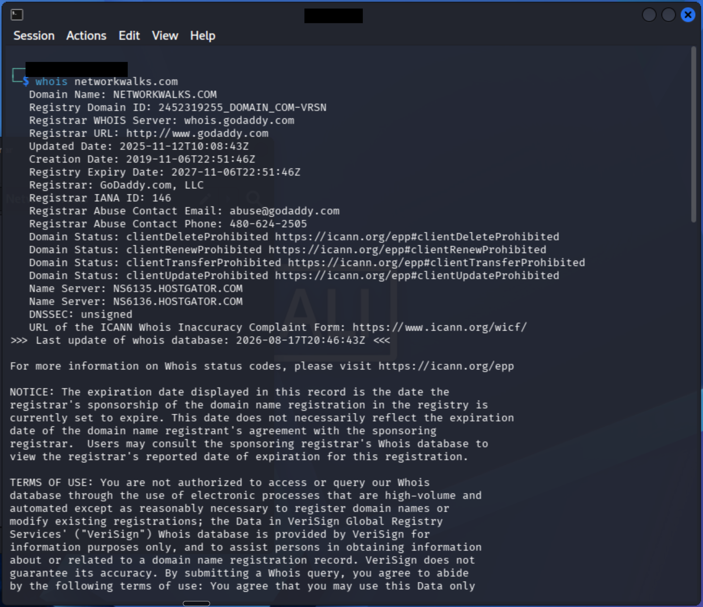

#### WhatWeb Technology Fingerprint (`whatweb networkwalks.com`)
*Shows WordPress 7.0.4, WP Download Manager 3.3.58, Apache, and target IP.*
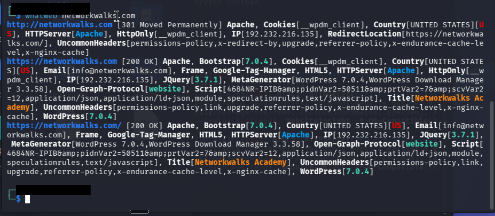

#### Nslookup DNS Resolution (`nslookup networkwalks.com`)
*Resolves domain directly to IP 192.232.216.135.*
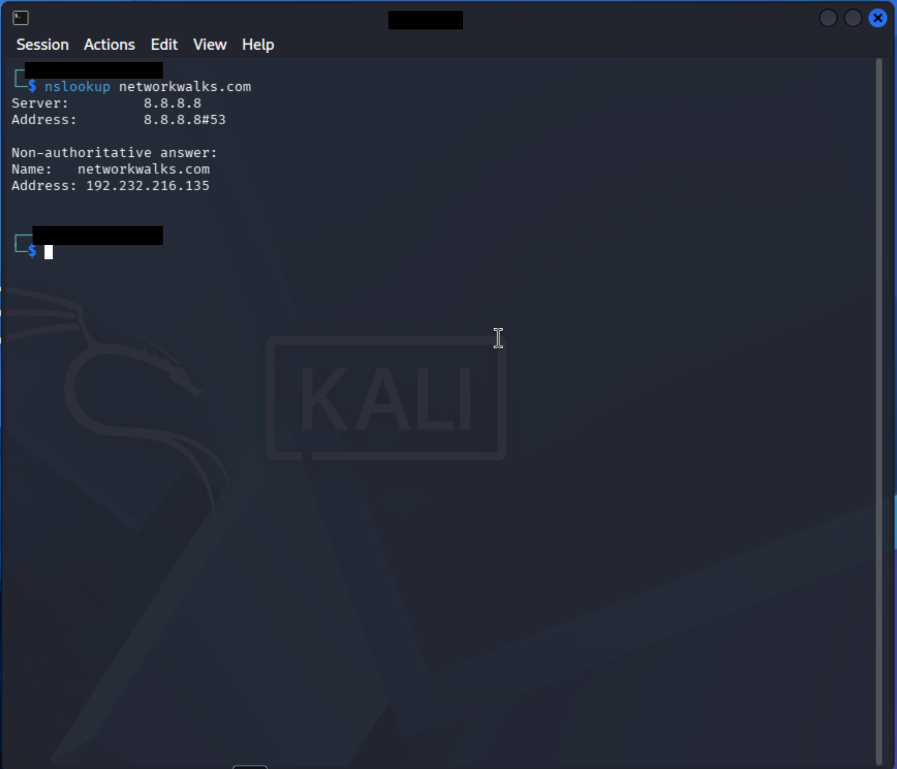

#### Curl -I Response Headers (`curl -I https://networkwalks.com`)
*Shows HTTP headers, Apache server, WordPress cache, and REST API link (session token sanitized).*
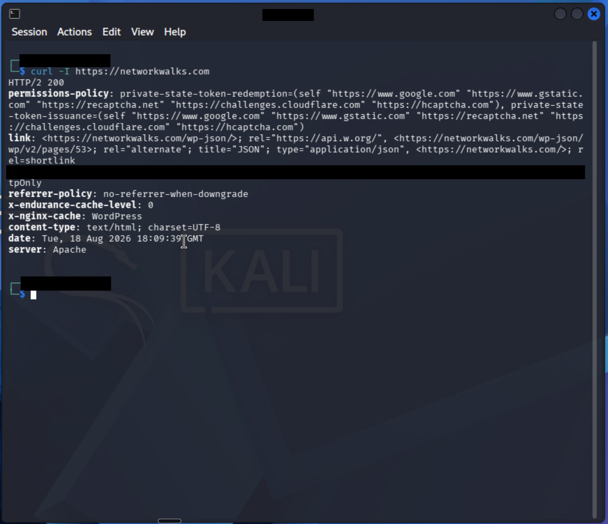

#### DNSRecon Enumeration (`dnsrecon -d networkwalks.com`)
*Shows SOA, NS records, BIND version 9.16.23-RH, MX record, and SPF.*
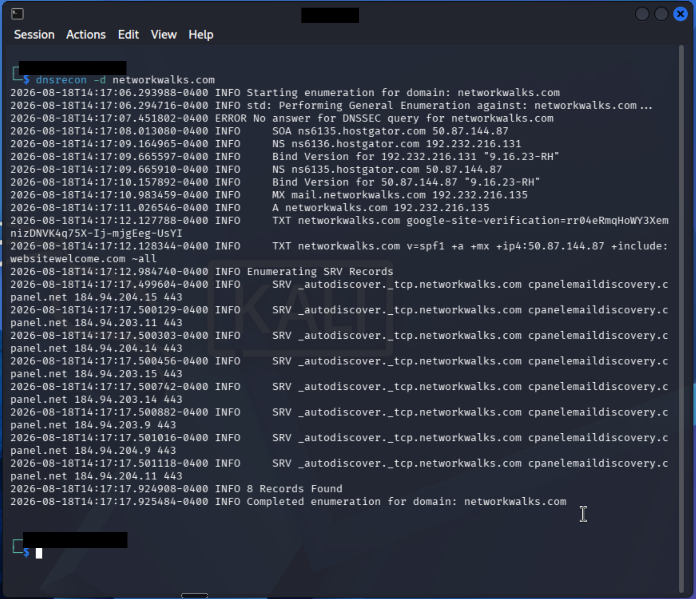

#### Wafw00f WAF Detection (`wafw00f networkwalks.com`)
*Confirms ModSecurity (SpiderLabs) Web Application Firewall.*
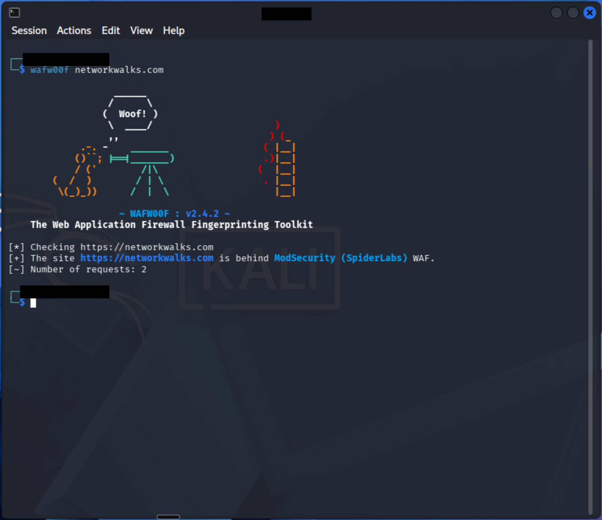

---

### 8.2 Maltego Visual OSINT Evidence (W2-PM3)

#### Maltego Data Hub & Transform Hub Setup
*Maltego Graph 4.12.1 setup with OSINT transforms and partner integrations.*
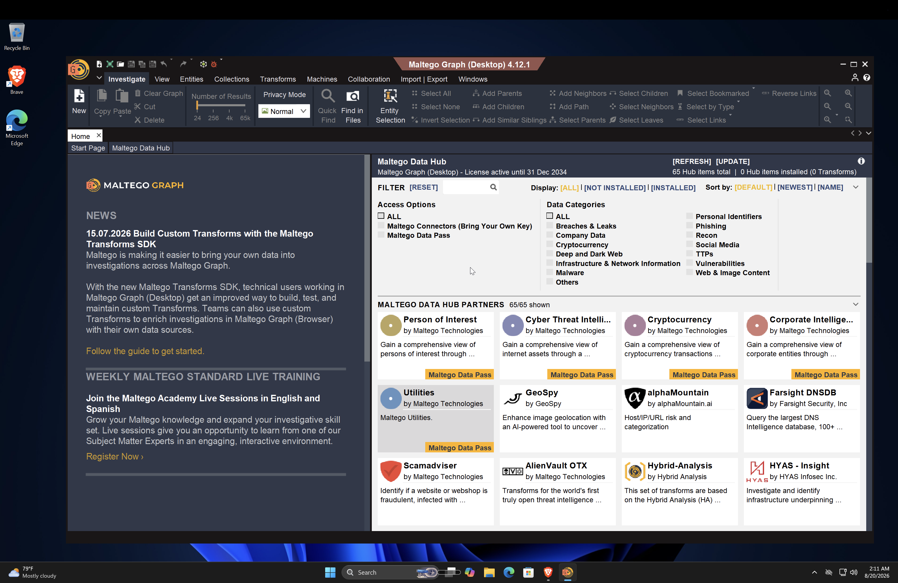

#### Maltego Email Harvesting on `microsoft.com` (Lab Demo)
*Demonstration of email extraction transforms on a large corporate domain.*
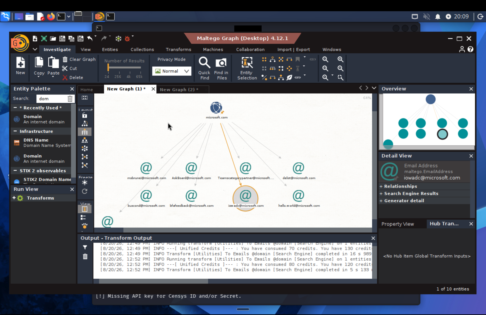

#### Maltego Domain-to-Contact Linkage on `networkwalks.com`
*Graph mapping associating domain node with info@networkwalks.com contact.*
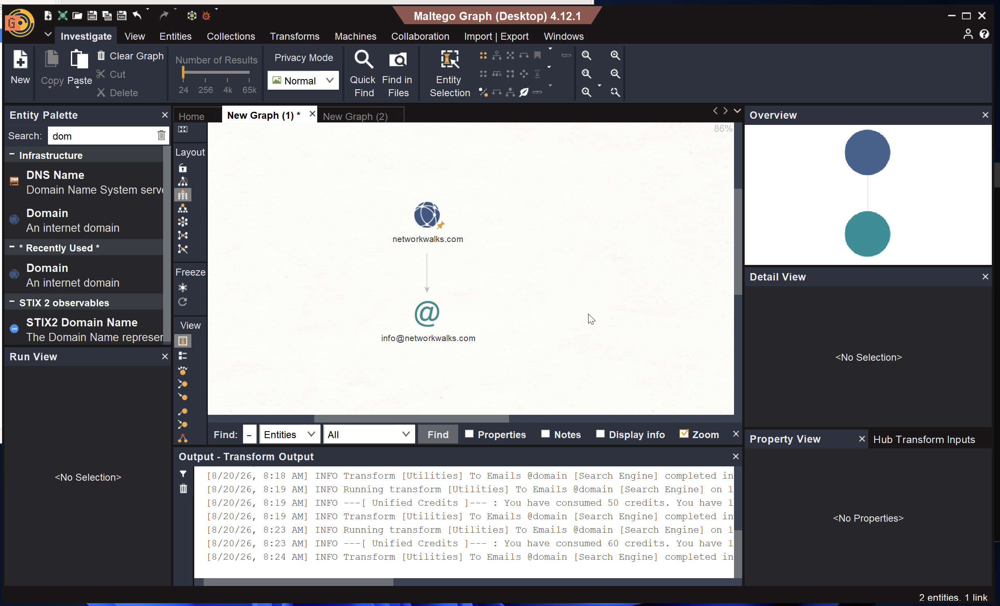

---

### 8.3 theHarvester Passive OSINT Evidence (W2-PM4)

#### Subdomain Enumeration via Baidu Search Engine
*Passive harvest of 8 subdomains without generating direct traffic on the target.*
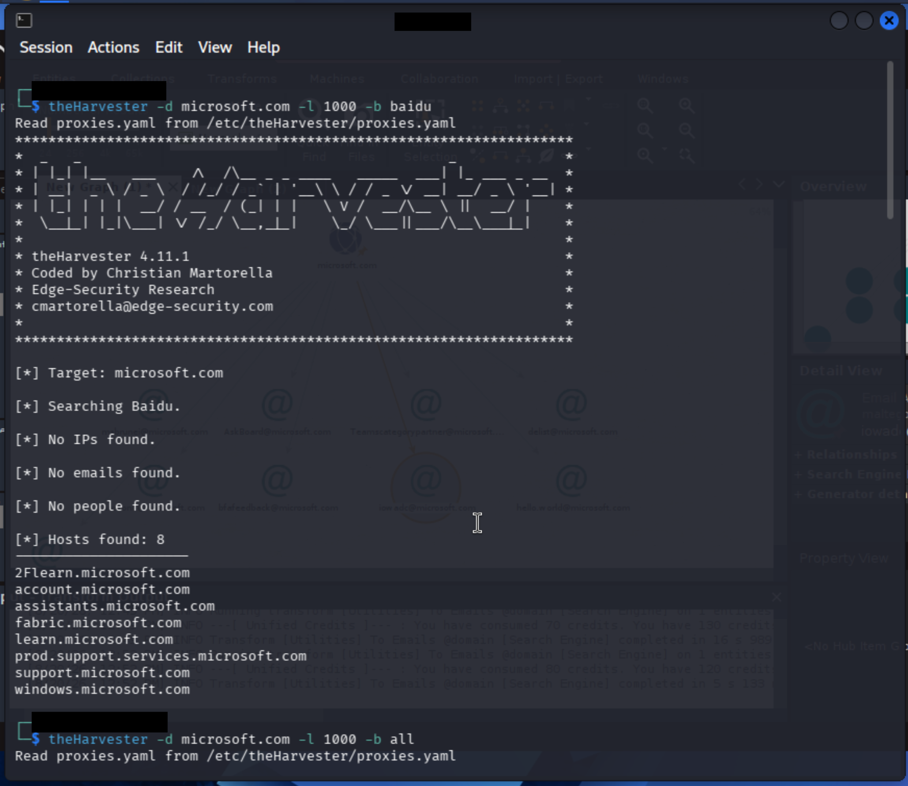

#### Multi-Source Engine Passive Scan (`-b all`)
*theHarvester query across all search engines and threat intel API checks.*
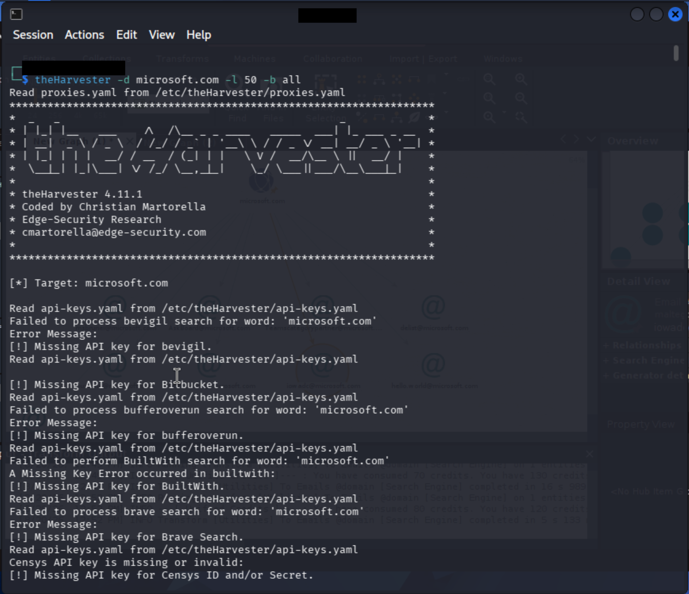

---

### 8.4 Zenmap & Nmap Local Network Scanning Evidence (W2-PM5)

#### Zenmap Subnet Quick Scan (`192.168.64.0/24`)
*Discovered 3 live hosts: Gateway (.1), Web server (.2), and Windows host (.10) (Hardware MACs sanitized).*
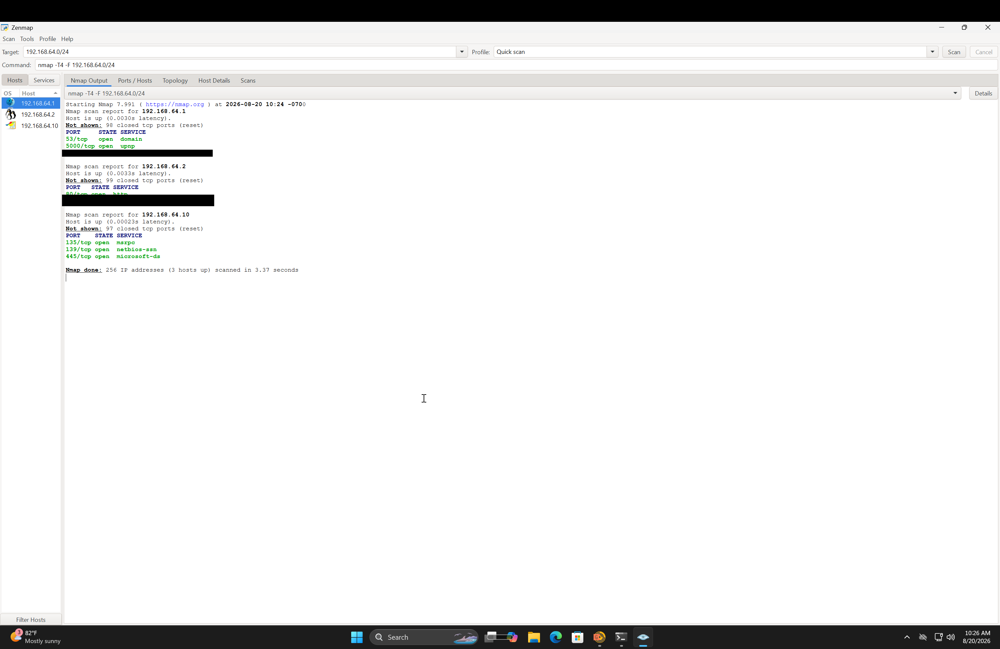

#### Windows Host Network Configuration & `ipconfig /all` Correlation
*Local interface details confirming IP 192.168.64.10 and open NetBIOS/SMB services (Hardware MACs, IPv6, and user paths sanitized).*
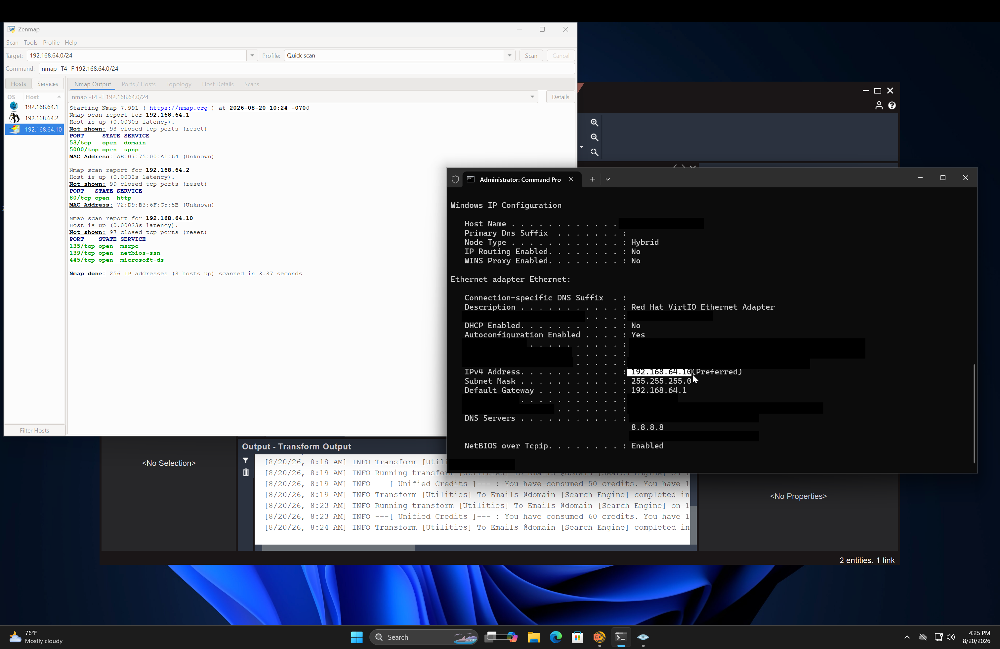

---

## -End-

👤 **Author**  
**Cybersecurity Professional**  
Batch: **B082-Networkwalks**  
Repository: [Penetration-Testing-Reports---Internship-Week2-Task-](https://github.com/dr-winner/Penetration-Testing-Reports---Internship-Week2-Task-)

📌 **Project Information**  
**Program Name**: Cybersecurity program at Networkwalks | **Week**: 02 | **Repository**: GitHub
